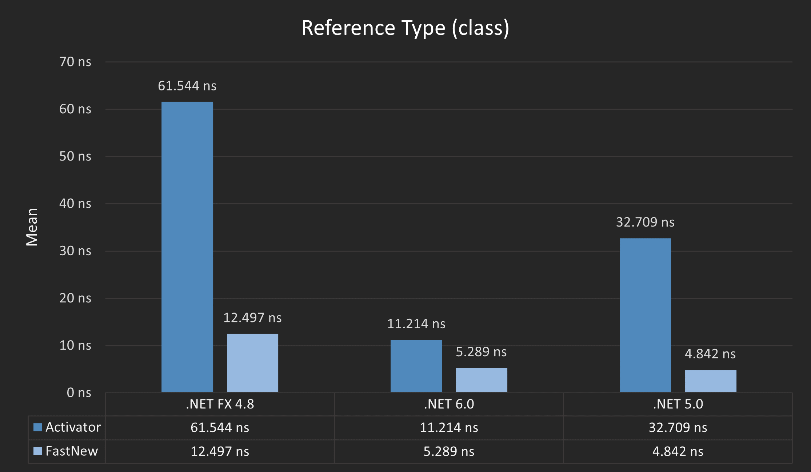
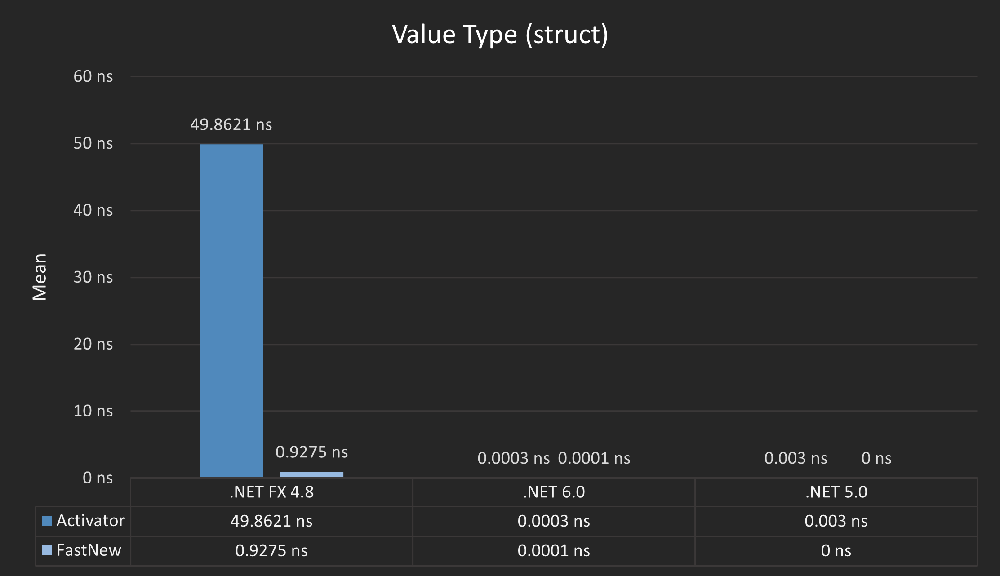

# FastGenericNew (3.0.0 WIP)

The ultimate fast alternative to `Activator.CreateInstance<T>`

## Features

- A way better CreateInstance
  - Up to 50x faster than `Activator.CreateInstance<T>`
  - Generic Parameters Support
  - Non-Public Constructor Support
  - Zero boxing/unboxing
  - No Generic Constraints
  - TryGetValue-like TryFastNew API
  - Link Mode PublishTrimmed Support

- Modern Compiler Integration
  - Source Generator v2 (Incremental Generator)
  - Highly Configurable
  - Multi-threaded Generation

- Lastest C# Features Support
  - [C# 8 Nullable](https://docs.microsoft.com/en-us/dotnet/csharp/language-reference/builtin-types/nullable-reference-types) Support
  - [C# 10 Parameterless struct constructors](https://docs.microsoft.com/en-us/dotnet/csharp/language-reference/proposals/csharp-10.0/parameterless-struct-constructors) Support (Both invokes or not)

## Installation

> You can only use one of them

### Pre-Compiled Version

```powershell
dotnet add package FastGenericNew --version 3.0.0-preview1
```

```xml
<ItemGroup>
  <PackageReference Include="FastGenericNew" Version="3.0.0-preview1" />
</ItemGroup>
```

### SourceGenerator Version

```powershell
dotnet add package FastGenericNew.SourceGenerator --version 3.0.0-preview1
```

```xml
<ItemGroup>
  <PackageReference Include="FastGenericNew.SourceGenerator" Version="3.0.0-preview1" />
</ItemGroup>
```

## Examples

```cs
using FastGenericNew;

FastNew.CreateInstance<T>();

// With parameter(s)
FastNew.CreateInstance<T, string>("text");
FastNew.CreateInstance<T, string, int>("text", 0);

// Try 
if (FastNew.TryCreateInstance<T, string>("arg0", out T result));
{
    // ...
}
```

### Notes

> **With .NET Framework**, `Activator.CreateInstance<T>()` invokes the parameterless constructor of `ValueType` if the constraint is `where T : new()` but appears to **ignore the parameterless constructor if the constraint is `where T : struct`**.  
> **But `FastNew.CreateInstance<T>()` will always invoke the parameterless constructor if it's available.**  
> If you don't want to invoke the parameterless constructor of `ValueType`.  
> Consider to use `FastNew.NewOrDefault<T>()` which **will never invoke the parameterless constructor of `ValueType`**

## Benchmark  

### **Environment**

``` ini
BenchmarkDotNet=v0.13.1, OS=Windows 10.0.22000
AMD Ryzen 9 3900X, 1 CPU, 24 logical and 12 physical cores
.NET SDK=6.0.200-preview.22055.15
  [Host]             : .NET 6.0.2 (6.0.222.6406), X64 RyuJIT
  .NET 5.0           : .NET 5.0.14 (5.0.1422.5710), X64 RyuJIT
  .NET 6.0           : .NET 6.0.2 (6.0.222.6406), X64 RyuJIT
  .NET Framework 4.8 : .NET Framework 4.8 (4.8.4470.0), X64 RyuJIT
```

### Reference Types

  

### Value Types



## License

FastGenericNew is licensed under the [MIT](LICENSE) license.
